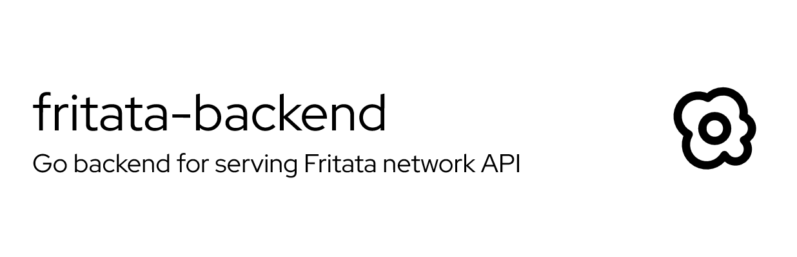

**Fritata backend** serves API to the Fritata platform. It consists of 3 Dockerized microservices:
- Auth microservice: handling account creation and authentication processes
- Users microservice: handling user account data
- Posts microservice: handling user-generated content


# Documentation

## Azure setup

### Azure Database for PostgreSQL - Flexible Server
#### Create SQL server resource in Azure Portal

In my implementation, I used these settings:
- Size: B1ms - 1 vCores, 2 GiB RAM, 32 GiB storage

Create an Administrator acount and save username & password

### Perspective API (Moderation API)
Follow [instructions](https://developers.perspectiveapi.com/s/docs-get-started) for setting up GCP API

Save the generated API key for later

### Virtual Machine
#### Create a VM resource in Azure Portal
In my implementation, I used these settings:
- Region: (Europe) Germany West Central
- Avaliability zone: Zone 1
- Image: Ubuntu Server 24.04 LTS - x64 Gen2
- Size: Standard_B2s - 2 vcpus, 4GiB memory ($35.04/month)
- OS disk type: Standard SSD
- Public inbound ports: HHTPS (443), SSH (22)

Create an Administrator account and save the SSH key

#### Set up VM from terminal
SSH into the machine from your local computer:
```bash
ssh -i <PATH TO .pem FILE> <USERNAME>@<PUBLIC VM IP>
```

Update and reboot the machine:
```bash
sudo apt update
sudo apt upgrade -y
sudo reboot
```

Install docker:
```bash
sudo apt install -y docker.io
sudo systemctl enable docker
sudo systemctl start docker
sudo usermod -aG docker $USER
newgrp docker
```

Install minikube and kubectl:
```bash
curl -LO https://storage.googleapis.com/minikube/releases/latest/minikube-linux-amd64
sudo install minikube-linux-amd64 /usr/local/bin/minikube && rm minikube-linux-amd64

curl -LO https://dl.k8s.io/release/v1.31.0/bin/linux/amd64/kubectl
sudo install -o root -g root -m 0755 kubectl /usr/local/bin/kubectl

minikube start --driver=docker

minikube addons enable ingress
```

Install Caddy:
```bash
sudo apt install -y caddy
```

Setup Caddy config file `/etc/caddy/Caddyfile` (replace `PUBLIC VM IP` with VM's public IP):
```
<PUBLIC VM IP>.nip.io {
    # Auth API
    reverse_proxy /api/v1/auth 192.168.49.2:30000
    reverse_proxy /api/v1/auth/* 192.168.49.2:30000
    reverse_proxy /api/v1/swagger/auth/* 192.168.49.2:30000
    reverse_proxy /api/v1/health/auth 192.168.49.2:30000
    reverse_proxy /api/v1/health/auth/* 192.168.49.2:30000

    # Users API
    reverse_proxy /api/v1/users 192.168.49.2:30010
    reverse_proxy /api/v1/users/* 192.168.49.2:30010
    reverse_proxy /api/v1/swagger/users/* 192.168.49.2:30010
    reverse_proxy /api/v1/health/users 192.168.49.2:30010
    reverse_proxy /api/v1/health/users/* 192.168.49.2:30010

    # Posts API
    reverse_proxy /api/v1/posts 192.168.49.2:30020
    reverse_proxy /api/v1/posts/* 192.168.49.2:30020
    reverse_proxy /api/v1/swagger/posts/* 192.168.49.2:30020
    reverse_proxy /api/v1/health/posts 192.168.49.2:30020
    reverse_proxy /api/v1/health/posts/* 192.168.49.2:30020

    # Logging
    log {
        output file /var/log/caddy/access.log
        format json
    }
}
```

Start Caddy:
```bash
sudo systemctl enable caddy
sudo systemctl start caddy
```


# Environment Variables
To run this project, you will need to create a `.env` file. It's structure should look like this:
```
DB_HOST=<POSTGRESQL HOSTNAME / IP>
DB_PORT=<POSTGRESQL ACCESS PORT>
DB_NAME=<POSTGRESQL DATABASE NAME>
DB_USER=<POSTGRESQL ACCESS USERNAME>
DB_PASSWORD=<POSTGRESQL ACCESS PASSWORD>

JWT_SECRET=<A RANDOM STRING FOR JWT VALIDATION>

API_MODERATION_KEY=<MODERATION API KEY>
```
Move `.env` file to whichever folder the backend will run on, as kubernetes will load this file into environment before running the microservice containers.


# Run Locally

#### Clone the project (Prerequesite: git)
```bash
  git clone https://github.com/Project-Fritata/fritata-backend.git
```

#### Go to the project directory
```bash
  cd fritata-backend
```

#### Start the Docker containers (Prerequesite: Docker)

Build is necessary only for the first time, and after any code changes.

```bash
  docker compose -f .\docker-compose.dev.yml build --no-cache
  docker compose -f .\docker-compose.dev.yml up
```

#### Access the APIs

Access through cURL, Postman, Insomnia, ...
- Auth microservice:
    - Client API: `http://localhost:8000/api/v1/auth`
- Users microservice:
    - Client API: `http://localhost:8010/api/v1/users`
    - Service API: `http://localhost:8011/api/v1/users`
- Posts microservice:
    - Client API: `http://localhost:8020/api/v1/posts`


# Deployment to GitHub pages
#### Setup respository settings
In GitHub Repository secrets for Actions, add the following secrets:
- AZURE_VM_PUBLIC_IP
- AZURE_VM_SSH_KEY
- AZURE_VM_USERNAME
- DOCKER_HUB_PASSWORD
- DOCKER_HUB_USER_NAME
- HOST_DNS

#### Push local code to GitHub
When pushing code to `main` branch, the `publish.yml` GitHub Actions script will run and deploy the containerized microservices to Azure.

#### Access the APIs
Access through cURL, Postman, Insomnia, ...
- Auth microservice:
    - Client API: `http://localhost:8000/api/v1/auth`
- Users microservice:
    - Client API: `http://localhost:8010/api/v1/users`
    - Service API: `http://localhost:8011/api/v1/users`
- Posts microservice:
    - Client API: `http://localhost:8020/api/v1/posts`


# License
[CC BY-NC-SA 4.0](https://creativecommons.org/licenses/by-nc-sa/4.0/)
